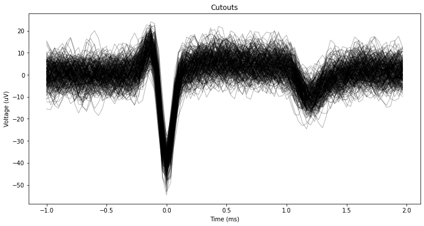

---
jupytext:
  text_representation:
    extension: .md
    format_name: myst
    format_version: 0.13
    jupytext_version: 1.13.8
kernelspec:
  display_name: Python 3 (ipykernel)
  language: python
  name: python3
file_format: mystnb
mystnb:
  execution_mode: 'off'
---

# Spike Cutout Visualization

```{code-cell} ipython3
:tags: [hide-cell]

import os, sys
import numpy as np
import quantities as pq
import matplotlib.pyplot as plt
```

```{code-cell} ipython3
:tags: [remove-cell]

from miv.io import load_continuous_data_file

datapath = '2022-03-10_16-19-09/Record Node 104/spontaneous/recording1/continuous/Rhythm_FPGA-100.0/continuous.dat'
rate = 30_000
timestamps, signal = load_continuous_data_file(datapath, 64, rate)
```

## Pre-Filter

```{code-cell} ipython3
:tags: [hide-cell]

from miv.signal.filter import ButterBandpass
from miv.signal.spike import ThresholdCutoff
```

```{code-cell} ipython3
pre_filter = ButterBandpass(lowcut=300, highcut=3000, order=5)
filtered_signal = pre_filter(signal, sampling_rate=rate)

spike_detection = ThresholdCutoff()
spks = spike_detection(filtered_signal, timestamps, sampling_rate=30_000, progress_bar=False)
```

## Plot

```{code-cell} ipython3
:tags: [hide-cell]

from miv.visualization import extract_waveforms, plot_waveforms
```

```{code-cell} ipython3
cutouts = extract_waveforms(
    filtered_signal, spks, channel=7, sampling_rate=rate
)
plot_waveforms(cutouts, rate, n_spikes=250)
```


